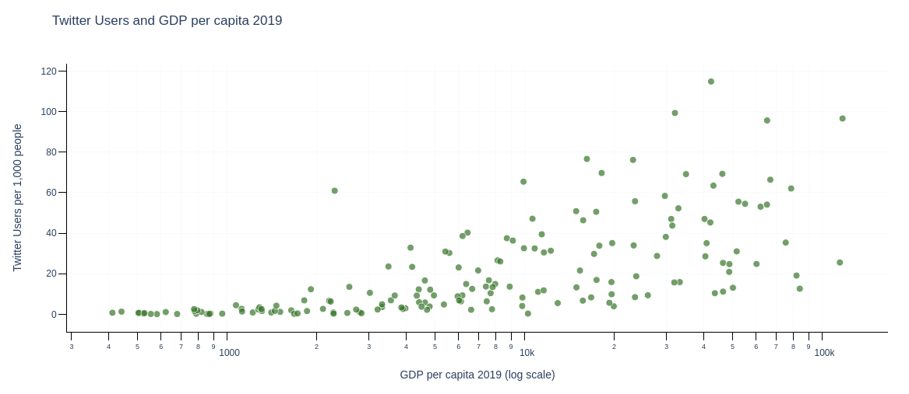
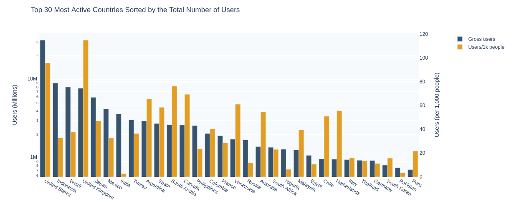

# Twitter tutorials

## Introduction
The rapid escalation of the COVID-19 crisis has emphasized the need to extract real-time policy insights from big data sources, especially in developing countries. In this project, we provide training material to educate development reseachers and practitioners on how to generate indicators from Twitter data on key issues associated with the COVID-19 crisis, with a focus on unemployment, public sentiment, and misinformation, highlighting practical examples focusing on Brazil, Mexico, and Pakistan.

## Content
This repository contains the following:
- A `notebooks` folder containing the Jupyter notebooks in `ipynb` format and related files
  - `1-download-from-twitter-api.ipynb`: details how to download tweets from the Twitter API using the module `tweepy`
  - `2-machine-translation.ipynb`: shows how to use state-of-the-art translation models from the Hugging Face model hub
  - `3-sentiment-analysis.ipynb`: performs sentiment analysis on Pakistani tweets with Hedonometer
  - `4-build-unemployment-index.ipynb`: builds an unemployment index from tweets located in Mexico 
  - `5-misinformation-analysis.ipynb`: quantifies misinformation in COVID-19-related tweets by looking for links whose domains are listed as fake news by [Newsguard](https://www.newsguardtech.com/coronavirus-misinformation-tracking-center/)
  - `6-gender-inference`: infers the gender of Twitter users located in Brazil 
  - An `outputs` folder containing graphs produced using these notebooks
- `README.md`: the present file

## Requirements
- The notebooks are written in Python 3. A basic knowledge of Python and of the most common Python modules such as `pandas` is required to understand these tutorials.
- There are no compulsory package requirements as all notebooks can be run on the cloud in Google Colab. To open a notebook in Google Colab, simply click on the  icon at the top of that notebook. In case you prefer to run the notebooks locally, specific package requirements are indicated at the top of each notebook.

## Motivation

### Twitter as a complementary data source

The booming use of social media platforms, such as Twitter, made individuals’ daily preoccupations and interests observable to researchers. Indicators derived from social media measures can help identify shifts in public opinion in real time and study attitudes and behaviors that might be hard to capture from traditional surveys. It can also inform and enhance the targeting of surveys as well as bring a new lens to understand public opinion on economic policy. On top of their informational value, these new data sources have the advantage of being easily accessible. In the case of Twitter, the data is accessible, with some download limit rate, to all users with a Developer account. World Bank staff also have the opportunity to access to the [Twitter Decahose](https://developer.twitter.com/en/docs/twitter-api/enterprise/decahose-api/overview/decahose), which provides a continuous stream of 10% of all tweets. 

### Challenges with Twitter data

One important challenge when working with Twitter data is the lack of representativeness of the population of Twitter users. Being on Twitter requires being literate, having a good Internet connection and an email address. As a result, the share of the world's population on Twitter tend to be located in richer countries and regions. This is illustrated in the figure below showing the relationship between Twitter penetration and GDP per capita (value of 2019). 

*Legend: Number of Twitter users per 1,000 inhabitants and GDP per capita, for countries with 50 or more Twitter users per 1,000 inhabitants and a GDP per capita of at least 10,000 USD. Estimates come from the Twitter decahose and include users whose profile location was identifed by the [Google Geocoding API](https://developers.google.com/maps/documentation/geocoding/overview).*

Twitter users are concentrated in North and South America, Western Europe, Northeast and Southeast Asia. By contrast, only a small fraction of the African population is on Twitter.

*Legend: Estimates of the number of Twitter users per city. Each dot represents a city, the size of each dot encodes the gross number of Twitter users reporting to live in that city, for cities with 300,000 inhabitants or more.*

Some countries have relatively high penetration rate, with more than 5% of their population using Twitter. This set includes some developed countries such as the United Kingdom (11.4%), the USA (9.5%) or Canada (6.9%) as well as middle income countries such as Uruguay (7.6%), Argentina (6.5%) or Venezuela (6%), as well as countries with a small population such as Kuwait with 9.9%, Bermuda with 9.6% or Barbados with 6.9%. Complete estimates of Twitter penetration rate per country can be found [here](https://github.com/worldbank/TwitterEconomicMonitoring/blob/master/visualizations/data/twitter_coverage_countries.csv).

London is the city with the largest number of Twitter users with 1.6 million users, followed by New York (1.5 million) and Jakarta (1.2 million). In terms of share of the population, the top 2 cities are in Indonesia with 59% of Yogyakarta's inhabitants and 23% of Bandung's being on Twitter. Complete estimates of Twitter penetration rate per city can be found [here](https://github.com/worldbank/TwitterEconomicMonitoring/blob/master/visualizations/data/twitter_coverage_cities.csv). 

Beyond socio-economic and geographical biases, there are large heterogeneities in how active Twitter users are. According to Twitter, estimates from 2011 indicate that 40% of users would only sign in just to read messages from other users. Some users may not even be humans, with between 9% and 15% of 2017 active users being bots (Varol et al., 2017).

### Demographic inference as a solution

To address these limitations, researchers have tried to either augment Twitter data with external data sources containing socioeconomic information on individuals, or infer demographic characteristics of Twitter users to build more representative samples. For instance, Grinberg et al. (2019) match Twitter accounts with U.S. registered voters using their name, creating a representative panel of voters. When a dataset such as the U.S. voting registry is not available, which is the case for most of the rest of the world, demographics characteristics such as age and gender, or whether the account belong to an organization, can be inferred based on user self-reported information (Nguyen et al., 2013; Chamberlain et al., 2017; Wang et al., 2019). In this tutorial, we include one notebook containing a toy example of how demographic characteristics of Twitter users can be inferred from the data. 

## References

Chamberlain, B. P., Humby, C., & Deisenroth, M. P. (2017, September). Probabilistic inference of twitter users’ age based on what they follow. In Joint European Conference on Machine Learning and Knowledge Discovery in Databases (pp. 191-203). Springer, Cham.

Dodds, P., Clark, E., Desu, S., Frank, M., Reagan, A., Williams, J., Mitchell, L., Harris, K., Kloumann, I., Bagrow, J., Megerdoomian, K., McMahon, M., Tivnan, B., & Danforth, C.. (2014). Human language reveals a universal positivity bias.

Grinberg, N., Joseph, K., Friedland, L., Swire-Thompson, B., & Lazer, D. (2019). Fake news on Twitter during the 2016 US presidential election. Science, 363(6425), 374-378.

Nguyen, D., Gravel, R., Trieschnigg, D., & Meder, T. (2013, June). " How Old Do You Think I Am?" A Study of Language and Age in Twitter. In Proceedings of the International AAAI Conference on Web and Social Media (Vol. 7, No. 1).

Roesslein, J. (2020). Tweepy: Twitter for Python!URL: https://github.com/tweepy/tweepy.

Varol, O., Ferrara, E., Davis, C., Menczer, F., & Flammini, A. (2017, May). Online human-bot interactions: Detection, estimation, and characterization. In Proceedings of the International AAAI Conference on Web and Social Media (Vol. 11, No. 1).

Wang, Z., Hale, S., Adelani, D. I., Grabowicz, P., Hartman, T., Flöck, F., & Jurgens, D. (2019, May). Demographic inference and representative population estimates from multilingual social media data. In The World Wide Web Conference (pp. 2056-2067).

Thomas Wolf, Lysandre Debut, Victor Sanh, Julien Chaumond, Clement Delangue, Anthony Moi, Pierric Cistac, Tim Rault, Rémi Louf, Morgan Funtowicz, Joe Davison, Sam Shleifer, Patrick von Platen, Clara Ma, Yacine Jernite, Julien Plu, Canwen Xu, Teven Le Scao, Sylvain Gugger, Mariama Drame, Quentin Lhoest, & Alexander M. Rush (2020). Transformers: State-of-the-Art Natural Language Processing. In Proceedings of the 2020 Conference on Empirical Methods in Natural Language Processing: System Demonstrations (pp. 38–45). Association for Computational Linguistics.
